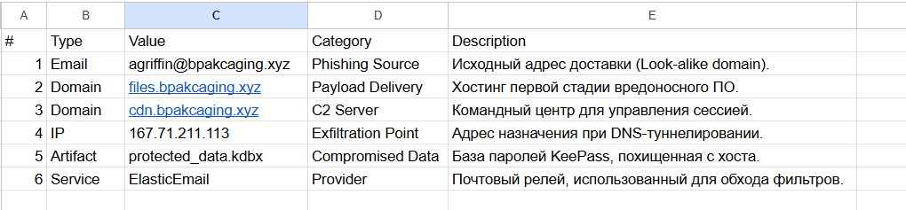

DFIR Investigation: Case "Boogeyman 1"

1. Executive Summary
  Инцидент: Фишинговая атака с последующей эксфильтрацией данных.  

  Дата: Январь 2023 года (согласно именам файлов).  

  Критичность: CRITICAL.  

  Вердикт: True Positive. Подтверждена кража финансовых данных и мастер-паролей

2. Victim Information
   
   Name: Julianne Westcott.
   
   Email: julianne.westcott@hotmail.com.
   
   Organization: Quick Logistics LLC.
   
   Department: Finance.

Figure 1: Initial phishing email analysis and relay identification.

3. Indicators of Compromise (IoC)

#     |     Type      |    Value               |       Category
1          Email        agriffin@bpakcaging.xyz
2          Domain       files.bpakcaging.xyz
3          Domain       cdn.bpakcaging.xyz
4           IP          167.71.211.113
5          Artifact     protected_data.kdbx

4. Phase 3: Data Exfiltration & Network Analysis

   Анализ трафика (capture.pcapng) через Wireshark подтвердил факт кражи конфиденциальных данных.

     Access Target: База данных plum.sqlite приложения Microsoft Sticky Notes.

     Master Password Recovery: В ходе анализа HTTP-потоков был перехвачен мастер-
     пароль: %p9^3!lL^Mz47E2GaT^y.

     Exfiltrated File: protected_data.kdbx (база данных KeePass).

     Exfiltration Technique: Использование DNS-туннелирования (протокол DNS, запросы типа A)
      через утилиту nslookup для скрытого вывода данных на IP 167.71.211.113

Figure 3: Identification of DNS exfiltration traffic and C2 communication.

5. MITRE ATT&CK Mapping

   TA0001 - Initial Access: Phishing: Spearphishing Attachment (T1566.001).
   
   TA0002 - Execution: Command and Scripting Interpreter: PowerShell (T1059.001).
   
   TA0007 - Discovery: System Information Discovery (T1082) via Seatbelt.
   
   TA0010 - Exfiltration: Exfiltration Over Alternative Protocol: DNS (T1048.003).
